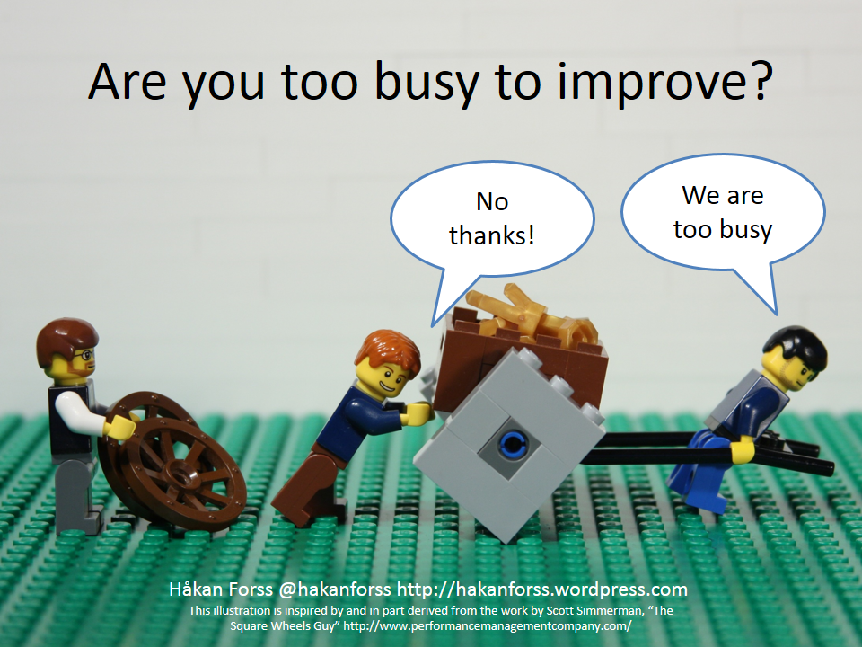
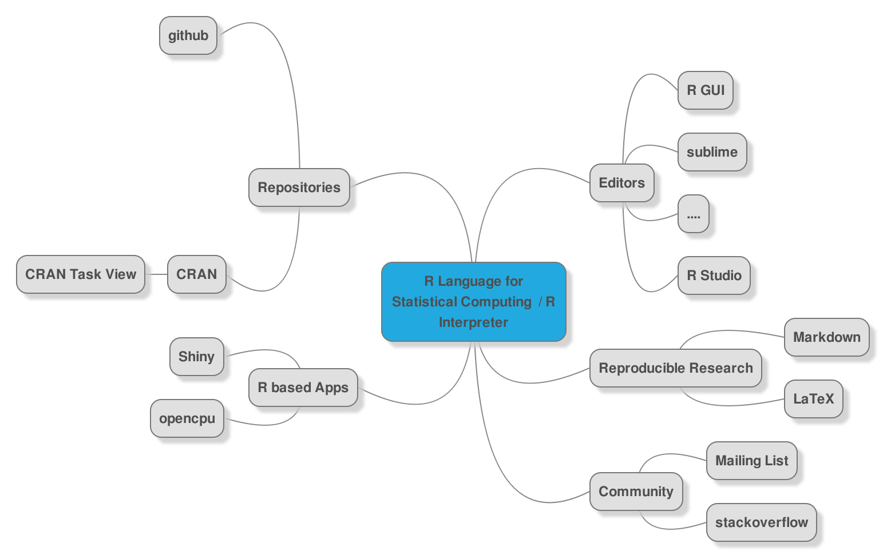

## About Me 

### Matthias Bannert
- researcher / developer at ETH Zurich 
- member of the iscience research group of Prof. Reips
- studied economics in Constance
- uses R since 2006
- develops packages since 2010
- teaching at the ETH, University of Constance, Webdatanet Training School

## Course Poll
```{r,echo=FALSE}
source("../lib/bullet.R")
library(grid)
library(shiny)

fluidPage(sidebarLayout(sidebarPanel(
  numericInput("members", "Number of participants", 8),
  numericInput("html", "R", 8),
  numericInput("json", "LaTeX", 8),
  numericInput("rstats", "Markdown", 8)  
  ),
  mainPanel(
    renderPlot({
      techavg <- mean(c(input$html,input$json,input$rstats) / input$members)*100
  df1 <- data.frame(units = c("R(%)","LaTeX (%)","MD(%)"),
                    low = c(25,25,25),
                    mean = c(50,50,50),
                    high = c(100,100,100),
                    target = c(techavg,techavg,techavg),
                    value = c(100*(input$html/input$members),
                              100*(input$json/input$members),
                              100*(input$rstats/input$members)
                              )
                    )

  g <- gridBulletGraphH(df1,bcol = c("#999999","#CCCCCC","#E1E1E1"),
                   vcol = "#333333",font = 20)

  g + title(paste("Usage of Technologies Among Participants", sep=" "))

})  


    )
  ))
```

## Interactive: Sneak Preview R and RStudio
- Console
- Script Window
- File Browser
- Plot
- Help
- Auto Complete
- Projects

## Why Code? 


## Because ...

- it's reproducible
- you can automate things
- we can actually understand what's going on
- it's more flexible
- ...


## Live Examples
- Understanding: BP Test
- Reproducible Research: Render a paper with knitr  / this presentation
- Interactive Web Applications (shiny gallery, showmeshiny)
- Tweet Mining / Text Mining


<!-- Break / form teams -->

## The R Ecosystem


## Interactive: Basics


## Markdown
- not a programming language
- solely formatting ("dumb language"), write "hello" it will return "hello".
- .md, .Rmd file extensions


## Interactive: Create an own Markdown document
